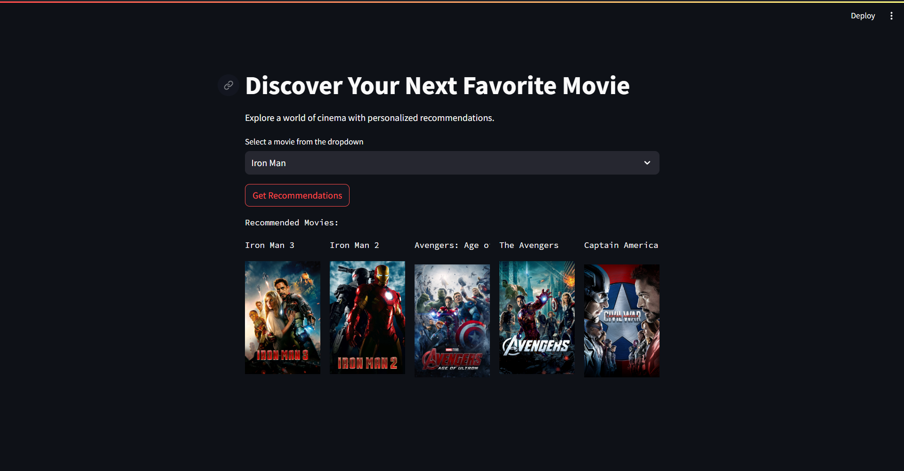
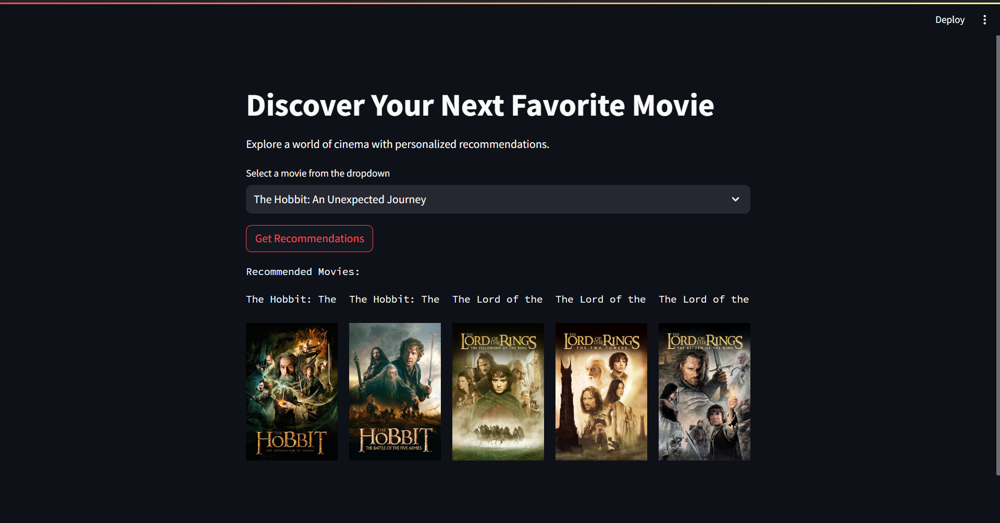
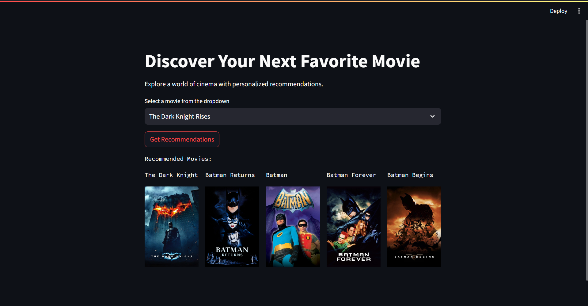

# Movie Recommender System

This project implements a content-based movie recommender system using Streamlit. Given a selected movie, it provides personalized recommendations for similar movies based on their descriptions, genres, keywords, cast, and crew information.

#### Demo Images

1. 
2. 
3. 

#### Installation and Usage

1. **Clone the Repository:**
   ```bash
   git clone https://github.com/hardikjp7/Movies-Recommender-System.git
   ```

2. **Navigate to Project Directory:**
   ```bash
   cd Movies-Recommender-System
   ```

3. **Install Dependencies:**
   ```bash
   pip install -r requirements.txt
   ```

4. **Run the Streamlit App:**
   ```bash
   streamlit run app.py
   ```

5. **Open the Web Browser:**
   Once the Streamlit app is running, open your web browser and go to `http://localhost:8501` to access the Movie Recommender System.

#### Features

- Allows users to select a movie from a dropdown menu.
- Provides personalized movie recommendations based on the selected movie.
- Displays movie posters along with their titles for easy visualization.
- Fullscreen layout for an immersive experience.
- Bigger poster size and bolder movie names for better visibility.

### Note:

Ensure that you have obtained the necessary API key from [The Movie Database (TMDb)](https://www.themoviedb.org/documentation/api) and saved it securely before running the Streamlit app.

For more information and detailed documentation, please refer to the project's GitHub repository: [Movies-Recommender-System](https://github.com/hardikjp7/Movies-Recommender-System)
